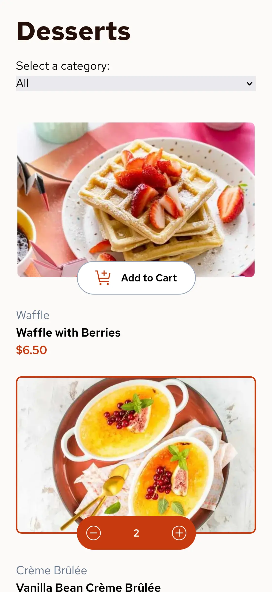

# Frontend Mentor - Product list with cart solution

This is a solution to the [Product list with cart challenge on Frontend Mentor](https://www.frontendmentor.io/challenges/product-list-with-cart-5MmqLVAp_d). Frontend Mentor challenges help you improve your coding skills by building realistic projects.

## Table of contents

- [Overview](#overview)
  - [The challenge](#the-challenge)
  - [Screenshots](#screenshots)
  - [Links](#links)
- [My process](#my-process)
  - [Built with](#built-with)
  - [What I learned](#what-i-learned)
  - [Continued development](#continued-development)
  - [Useful resources](#useful-resources)
- [Author](#author)

## Overview

### The challenge

Users should be able to:

- Add items to the cart and remove them
- Increase/decrease the number of items in the cart
- See an order confirmation modal when they click "Confirm Order"
- Reset their selections when they click "Start New Order"
- View the optimal layout for the interface depending on their device's screen size
- See hover and focus states for all interactive elements on the page

### Screenshots

### Links

- Solution URL: [This repo](https://github.com/Sir-M4kU/product-list-with-cart)
- Live Site URL: [Web page](https://example.com)

## My process

### Built with

- Astro
- Tailwind CSS
- Preact with Signals

### What I learned

- How to make a confirmation order component with dialog and making it responsive
- How to use preact signals
- Filtering products by category

### Continued development

- More unit testing and probably End to End testing

### Useful resources

- [Squish](https://squish.addy.ie) - This helped me to optimize all the images.
- [Squoosh](https://sqoosh.app) - Same as above but for screenshots.
- [Font Source](https://fontsource.org/) - To get the font used in the project.

## Author

- Frontend Mentor - [@Sir-M4kU](https://www.frontendmentor.io/profile/Sir-M4kU)
- GitHub - [@Sir-M4kU](https://github.com/Sir-M4kU)
